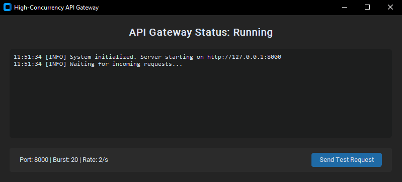
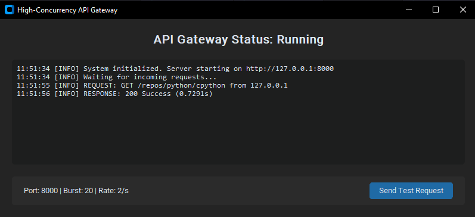
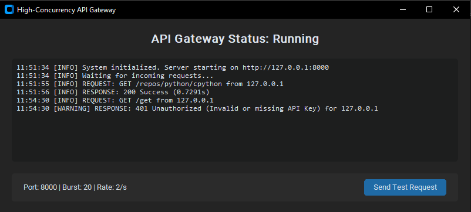
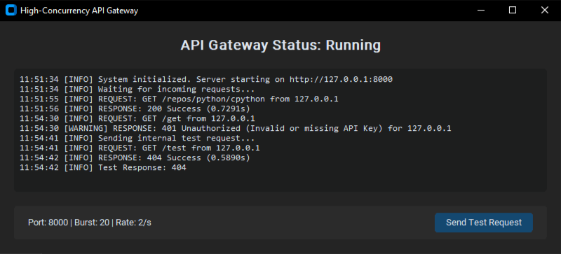

<h1 align="center">High-Concurrency API Gateway</h1>
<h3 align="center">FastAPI • Asyncio • Desktop UI Dashboard</h3>

<p align="center">
A professional-grade, high-performance API Gateway built with <b>Python 3.11+</b>, <b>FastAPI</b>, and <b>Asyncio</b>.
Includes a modern minimalist dark-themed desktop interface for real-time traffic monitoring and security management.
</p>

<p align="center">
  <a href="#-key-features">Features</a> •
  <a href="#-tech-stack">Tech Stack</a> •
  <a href="#-installation--usage">Installation</a> •
  <a href="#-academic-concepts-implemented">Concepts</a> •
  <a href="#-screenshots">Screenshots</a>
</p>

---

<p align="center">
  
  
  
  
  
  
  
  
</p>

---

## Overview

This project demonstrates a **high-throughput API Gateway** architecture capable of handling concurrent traffic safely using
asynchronous programming patterns.

It includes:
- a production-style **security layer**
- built-in **rate limiting**
- a **reverse proxy module**
- and a desktop UI dashboard for live monitoring

The gateway is designed to protect upstream services (GitHub API in this demo) from abuse, unauthorized requests, and excessive traffic.

---

## Key Features

- **High-Concurrency Engine**  
  Powered by `FastAPI` and `Uvicorn` for non-blocking async request processing.

- **Token Bucket Rate Limiting**  
  Implements a custom `AsyncTokenBucket` supporting:
  - Burst capacity: **20 tokens**
  - Steady refill rate: **2 tokens/sec**

- **Security Suite**
  - Mandatory API Key validation through request headers.
  - DDoS protection: Rejects request bodies larger than **512KB**.
  - Silent favicon handling.
  - Header sanitization to prevent unsafe forwarding.

- **Desktop Dashboard UI**
  - Built with `CustomTkinter`
  - Dark minimalist theme
  - Real-time request/response logging

- **Protocol Translation & Reverse Proxy**
  - Proxies requests to the **GitHub API**
  - Auto header cleanup
  - User-Agent injection for compatibility

---

## Tech Stack

### Languages & Frameworks
<p align="left">
  
</p>

### Libraries & Tools Used
- **Python 3.11+**
- **FastAPI** — Async API framework
- **Uvicorn** — High-performance ASGI server
- **Asyncio** — Concurrency & task scheduling
- **CustomTkinter** — Desktop UI dashboard
- **Token Bucket Algorithm** — Traffic shaping / fair usage
- **Middleware Architecture** — Clean separation of security logic
- **Reverse Proxy Logic** — Protects upstream services

---

## Architecture Summary

The system is designed around a typical API Gateway flow:

1. Client sends a request to the Gateway
2. Gateway validates API key + request size
3. Token bucket decides if request is allowed
4. Gateway forwards request to upstream service (GitHub API)
5. Response is captured and logged in Desktop UI
6. Clean response is returned to the client

This creates a secure buffer layer between clients and upstream APIs.

---

## Security Rules Implemented

| Security Feature | Purpose |
|-----------------|---------|
| API Key Validation | Blocks unauthorized clients |
| Max Body Size (512KB) | Prevents payload abuse |
| Token Bucket Rate Limiting | Prevents spam & DDoS |
| Header Sanitization | Prevents malicious forwarding |
| Silent Favicon Handling | Stops noise traffic |

---

## Installation & Usage

### 1️⃣ Clone the repository
```bash
git clone https://github.com/shanirayuran-commits/api-gateway.git
cd api-gateway
````

### 2️⃣ Install dependencies

```bash
pip install -r requirements.txt
```

### 3️⃣ Launch the Gateway + Desktop Dashboard

```bash
python desktop_app.py
```

---

## Testing

### Authorized Request (PowerShell)

```powershell
Invoke-RestMethod -Uri "http://127.0.0.1:8000/repos/python/cpython" -Headers @{"X-API-Key"="secret-token-123"}
```

### Unauthorized Request

```powershell
Invoke-RestMethod -Uri "http://127.0.0.1:8000/repos/python/cpython"
```

### Rate Limit Stress Test (Example)

Run multiple requests quickly to trigger token bucket rejection.

---

## Academic Concepts Implemented

* **Asynchronous Programming**: Leveraging Python `asyncio` for scalable network operations.
* **Traffic Shaping**: Token Bucket algorithm ensures fair request distribution under load.
* **Middleware Pattern**: Security and rate limiting decoupled from core proxy logic.
* **Reverse Proxy Architecture**: Protects upstream services from direct exposure and abuse.
* **High-Concurrency System Design**: Optimized request pipeline for non-blocking throughput.

---

## Use Cases

This project can be used as:

* A learning example for **Async API design**
* A demo for **API Gateway architecture**
* A security prototype for **rate-limited reverse proxy systems**
* A systems architecture portfolio project

---

## Screenshots

<details>
  <summary><b>Click to View Screenshots</b></summary>

  <br>

  <p align="center">
    
  </p>
  <p align="center"><i>Real-time monitoring of incoming requests and security status.</i></p>

  <br>

  <p align="center">
    
  </p>
  <p align="center"><i>Successful proxy of a request to the GitHub API.</i></p>

  <br>

  <p align="center">
    
  </p>
  <p align="center"><i>Gateway automatically blocking a request without a valid API Key.</i></p>

  <br>

  <p align="center">
    
  </p>
  <p align="center"><i>Token Bucket algorithm in action, limiting excessive traffic.</i></p>

</details>

---

## License

This project is licensed under the **MIT License**.

---

<p align="center">
  <b>Built as a Systems Architect demonstration.</b>
</p>

